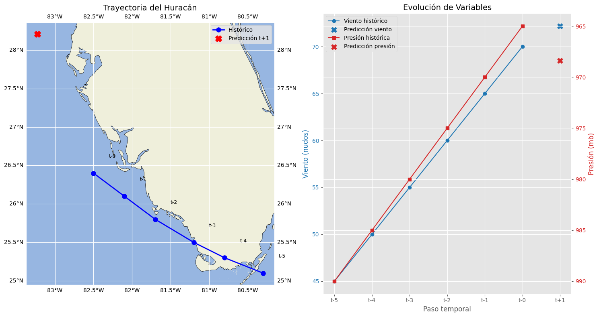

# Predicción de Trayectorias y Dinámicas de Ciclones con LSTM

Repositorio para el entrenamiento y evaluación de modelos LSTM destinados a predecir la trayectoria, presión y velocidad de ciclones y huracanes.

### Descripción del Proyecto

Este proyecto implementa dos redes neuronales basadas en LSTM (Long Short-Term Memory) para abordar la predicción de ciclones y huracanes. El primer modelo está diseñado para estimar la trayectoria de la tormenta (coordenadas geográficas) a partir de series temporales de presión atmosférica y velocidad del viento. El segundo modelo predice simultáneamente la presión y la velocidad del fenómeno utilizando todas las variables climatológicas disponibles.

Ambos modelos permiten realizar proyecciones a futuro, proporcionando salidas para pasos temporales siguientes y ofreciendo una herramienta útil para estudios de riesgos y sistemas de alerta temprana.

#### Estructura de los Modelos

- Modelo de Coordenadas (LSTM): procesa secuencias de presión y velocidad histórica para generar las latitudes y longitudes en el siguiente instante.

- Modelo de Presión y Velocidad (LSTM): recibe como entrada el conjunto completo de variables climatológicas y predice los próximos valores de presión atmosférica y velocidad del viento.

Se exploran además capas de atención para mejorar la capacidad del modelo de enfocarse en los puntos críticos de la evolución del fenómeno.

#### Conjunto de Datos

El dataset utilizado es HURDAT2, proporcionado por el Centro Nacional de Huracanes (NHC) y disponible públicamente. Este contiene registros históricos de ciclones y huracanes en el Atlántico y Pacífico, incluyendo coordenadas, presión mínima y velocidad máxima del viento en intervalos de 6 horas.

#### Proyecciones a Futuro

Ajuste de horizonte de predicción para estimar trayectorias y dinámicas a diferentes intervalos (6, 12, 24 horas).

Integración de variables oceánicas (temperatura superficial, corrientes) para mejorar la precisión.

#### Resultados

#### Contribuciones

Las contribuciones son bienvenidas. Por favor, abra un issue o envíe un pull request describiendo su mejora.